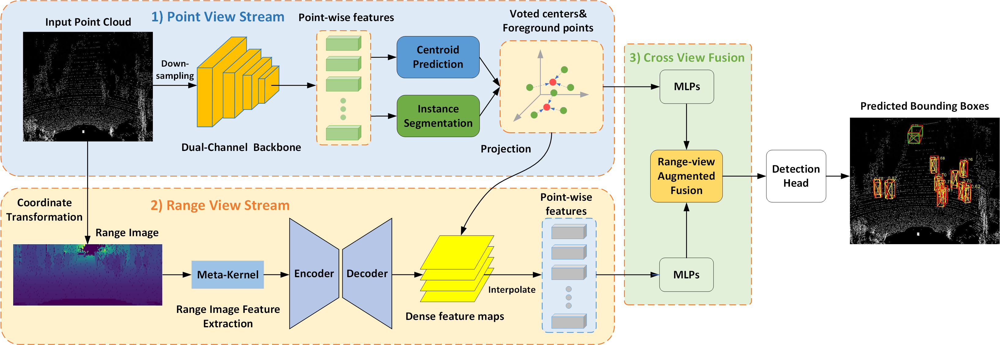

# RAFDet: Range View Augmented Fusion Network for Point-Based 3D Object Detection
This is an official implementation of RAFDet.

## Framework

  

In recent years, point-based methods have achieved promising performance on 3D object detection task. Although effective, they still suffer from the inherent sparsity of point cloud, which makes it challenging to distinguish objects with backgrounds only relying on the view of raw point. To this end, we propose a straightforward yet effective multi-view fusion network termed RAFDet to alleviate this issue. The core idea of our method lies in combining the merits of raw point and its range view to enhance the representation learning for sparse point cloud, thus mitigating the sparsity problem and boosting the detection performance. In particular, we introduce a novel bidirectional attentive fusion module to equip sparse point with interacted fine-grained semantic clues during feature learning process. Then, we devise the range-view augmented fusion module to fully exploit the supplementary relationship between different perspectives with the aim of enhancing original point-view features. In the end, a single-stage detection head is utilized to predict final 3D bounding boxes based on the enhanced semantics. We have evaluated our method on the popular KITTI Dataset, DAIR-V2X Dataset and Waymo Open Dataset. Experimental results on the above three datasets demonstrate the effectiveness and robustness of our approach in terms of detection performance and model complexity. 

## Getting Started
You may refer to [INSTALL.md](docs/INSTALL.md) for the installation of `RAFDet` and [GETTING STARTED.md](docs/GETTING_STARTED.md) to implement this project.

## Visualization

KITTI Val

  

KITTI Test

  

